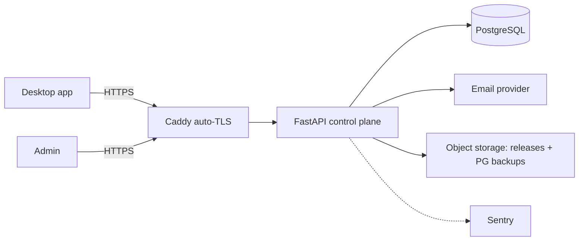

# Cloud control plane

**Status:** design. The hosted service that owns accounts, licences, devices, entitlements, and
update metadata. It **never** runs a browser or stores browser data. Sized for the stated initial
scale (10 users, 1–3 devices each, ~1,000 local profiles total, 2–4 vCPU / 4–8 GB, $20–60/mo).

## Shape: a modular monolith

One FastAPI application, one PostgreSQL database, behind Caddy, in Docker Compose. Internal modules
map 1:1 to the desktop's existing feature-slice style so the mental model transfers:

```
control_plane/
  auth/         registration, login (PKCE), sessions/refresh, password reset, (MFA later)
  devices/      device registration, signed-challenge verify, revocation, last-seen
  licensing/    activation keys, redemption, plans, entitlement signing, revocation list
  billing/      subscription status (Stripe optional; v1 can be admin-issued keys only)
  updates/      release channels, signed update manifests, min-version enforcement
  admin/        support lookup, key issue/revoke, device revoke, audit queries
  audit/        append-only security events
  email/        verification + reset delivery (provider-agnostic)
```

**Why a monolith, not Keycloak/Authentik:** for 10 users on a 2–4 vCPU box, an identity server
(~1 GB+ RAM, its own DB, upgrade ops) is disproportionate. A lean FastAPI auth module (argon2id,
rotating refresh, EdDSA-signed entitlements) fits the budget and the team's existing stack. Revisit
Keycloak only if SSO/enterprise IdP federation becomes a requirement. **Classification: build lean;
postpone Keycloak.**

## PostgreSQL

- One database; schema in Alembic migrations (mirrors the desktop's Alembic discipline).
- Tables (detailed in [cloud-data-model](cloud-data-model.md)): `users`, `email_verifications`,
  `password_resets`, `sessions` (device-bound refresh, rotation family), `devices`, `plans`,
  `activation_keys`, `redemptions`, `entitlements` (issued docs / derived), `subscriptions`,
  `audit_events`, `update_releases`.
- Config: `scram-sha-256` auth, TLS, least-privilege app role, `pg_dump`/WAL backups to object
  storage (see [deployment-and-cost](deployment-and-cost.md)). At this scale a single instance with
  daily base backups + WAL archiving is sufficient.

## Authentication (summary; full detail in [authentication.md](authentication.md))

- **OAuth 2.1 Authorization Code + PKCE** via the system browser (RFC 8252 native-app pattern),
  loopback redirect to the desktop. The desktop never handles the password.
- Passwords hashed with **argon2id** (same family already used locally, `auth/passwords.py:8-15`).
- Short-lived **access JWT (EdDSA)**; **rotated refresh** bound to the device key; reuse detection
  revokes the session family.

## Licensing (summary; full detail in [activation-and-entitlements.md](activation-and-entitlements.md))

- Activation keys are high-entropy, stored only as **keyed-hash verifiers** (HMAC-SHA256 + server
  pepper), one-time/limited redemption, plan-bound.
- After redemption the server returns a **signed entitlement** (EdDSA JWT: account, device, plan,
  limits, iat/exp, offline-grace, version). The desktop validates it against a **pinned public key**
  shipped in the app (public, not a secret) — so **no permanent secret is embedded**.
- **CloakBrowser engine licence is separate** and stays on the user's machine — the cloud never holds
  or brokers a universal engine key (both a security and a `BINARY-LICENSE.md` requirement).

## Email delivery

- A transactional provider (SES / Postmark / Resend / Mailgun) for verification + password-reset
  links only. Provider behind a small interface so it's swappable; DKIM/SPF configured on the sending
  domain. Free tiers cover 10 users.

## Administration

- A minimal admin surface (CLI first, small web later) behind admin auth + audit:
  issue/suspend/revoke activation keys, look up a customer **without ever displaying the full key**
  (by `lookup_prefix` + last-4), revoke a device, read the audit trail. For the first 10 customers,
  keys can be **issued manually** via the admin CLI — no billing integration required initially.

## Cross-cutting

- **Rate limiting + abuse controls** on login, password-reset, and activation-redemption (per-IP +
  per-account); lockout/backoff — a real fix for the current local login throttle, which is a single
  global in-memory counter (`auth/routes.py:99-105`), inadequate for a network service.
- **Audit trail** (append-only) for key creation/redemption, device registration/revocation, licence
  status changes, admin actions.
- **Secret-redacted logs**; tokens/keys never logged (carry the desktop's discipline server-side).
- **Observability:** Sentry for errors from day one; Prometheus/OpenTelemetry are **postponed** —
  overkill for 10 users, add when traffic justifies.

## Deployment topology



Single VPS, Docker Compose (`caddy`, `app`, `postgres`), rolling deploy by image tag. Scaling path
without protocol change: move Postgres to a managed instance, then run multiple stateless `app`
replicas behind Caddy — the desktop/cloud contract (signed entitlements + device-bound refresh) is
already stateless-friendly, so no client changes are needed to scale.
