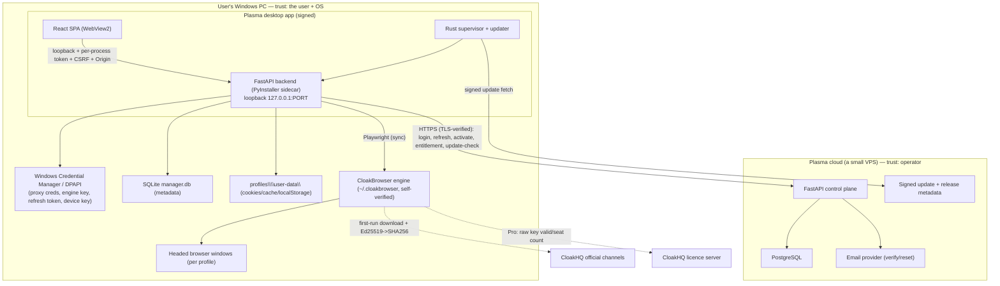
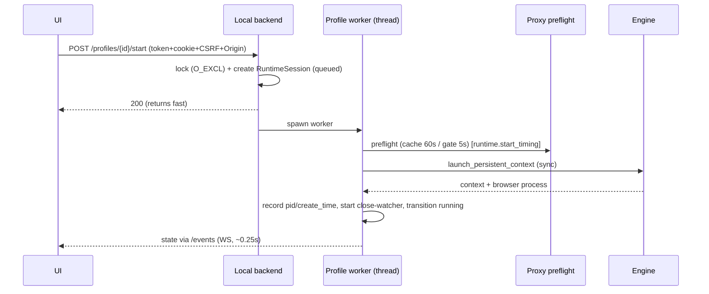
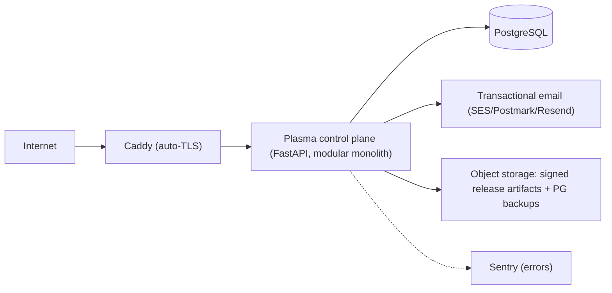

# System architecture

**Status:** design. Two systems: the **Plasma Windows desktop app** (UI + local backend + engine +
local profile store) and the **Plasma cloud control plane** (accounts, licences, devices,
entitlements, updates). All browsers and browser data stay on the user's machine; the cloud never
runs a browser or stores raw browser data.

## Components & boundaries

## Trust boundaries (and what crosses them)

1. **WebView ↔ local backend** (in-process, loopback). Crossing: HTTP with **per-process token +
   session cookie + CSRF + exact-Origin** (`config.py:23`, `dependencies.py:29-32`,
   `security.py:24-35`). No browser data leaves the box here.
2. **Local backend ↔ cloud** (Internet, TLS). Crossing: **only** account/licence/device/entitlement/
   update traffic — short-lived access JWT + device-signed refresh. **Never** cookies, proxy
   passwords, or profile data. TLS validated normally (no cert bypass).
3. **Local backend ↔ engine** (local process). Crossing: launch flags + (for Pro) the user's own
   engine key injected into the child env; the engine self-validates against CloakHQ. The binary is
   **verified, never modified** (`download.py` Ed25519→SHA256).
4. **App ↔ CloakHQ** (Internet). Crossing: per-user binary download from official channels only
   (licence requirement) — not proxied through Plasma's cloud.
5. **Cloud ↔ operator** (admin). Crossing: admin actions (issue/revoke keys, revoke devices) behind
   admin auth + audit log.

## Launch sequence (local, today's behavior + the token gate)

## Deployment topology (cloud)

- One small VPS (2–4 vCPU / 4–8 GB) runs everything via **Docker Compose**: Caddy + app + Postgres.
  No Kubernetes, no microservices for v1 (see [cloud-control-plane.md](cloud-control-plane.md) and
  [deployment-and-cost](deployment-and-cost.md)). The cloud needs no Windows and little RAM because
  Chromium runs on user machines.

## Module ownership (current code → target)

| Concern | Today (confirmed) | Target |
|---|---|---|
| UI | React/Vite SPA `manager/frontend/` | unchanged, hosted in Tauri WebView |
| Local API | FastAPI `manager_backend/`, loopback-only (`main.py:60-61`) | + `require_local_token` gate + per-process token |
| Profile store | SQLite + `profiles\<id>\user-data` + keyring | unchanged; data_root → `%LOCALAPPDATA%\Plasma` |
| Engine | auto-download + verify (`download.py`) | unchanged; **never bundled/modified** |
| Auth (local owner) | single-owner session + CSRF (`auth/`) | **replaced** at the identity layer by cloud account; local owner becomes the cloud-linked session |
| Cloud | **none today** | new FastAPI + PostgreSQL control plane |

The desktop is a **drop-in Playwright-backed** local product today; the cloud is purely additive and
must never become a dependency for opening/running existing local profiles within the offline grace
window.
