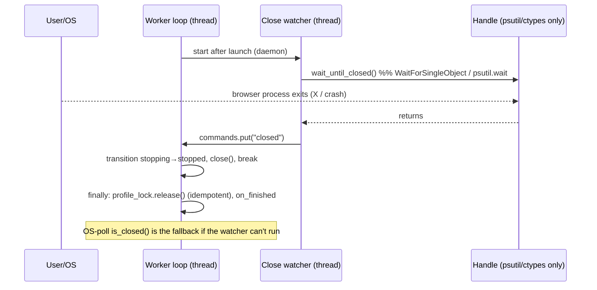

# Browser-close detection — design (P3)

**Status:** implemented on branch `fix/windows-icons-profile-startup` (uncommitted), tests-first.
Goal: an **immediate** browser-close signal **combined with** the existing OS-poll fallback, funneled
into **one idempotent finalization path** — without cross-thread Playwright access.

## Official vs Plasma (confirmed)

- **Official** registers a Playwright `close` event on its async context and finalizes in the
  callback: `context.on("close", lambda: asyncio.ensure_future(self._on_browser_closed(profile_id)))`
  (`official: browser_manager.py:268-270`). Works because everything runs on one asyncio loop that
  FastAPI already pumps.
- **Plasma** runs the **sync** Playwright driver inside a per-profile worker **thread** whose wait
  loop never pumps the driver, so the Playwright `close` event is unreliable — we already register it
  (`ours: launcher.py:349` → `_mark_closed`) but must not depend on it. Detection is instead an
  **OS-pid poll** on every ~0.1 s loop tick (`ours: launcher.py:491-521`, worker loop
  `worker.py`), and finalization is a **single path** in the worker with an **idempotent** lock
  release (`ours: locks.py:39-46`, guarded by `_acquired`).

**Trade-off / classification:** *Adapt with stronger safeguards.* We do **not** copy the async
callback (incompatible threading model, cross-thread driver risk). We add an OS-level, event-driven
close signal that is *more* reliable than a Playwright disconnect event and keeps the poll as fallback.

## Design

A per-runtime **process-exit watcher thread** blocks until the browser **process** exits, then wakes
the worker via its existing command queue. One extra command value, `"closed"`, joins `"stop"` — the
worker's single finalization branch handles all of them, so there is exactly one finalization path.

- **Immediate primitive (Windows-first):** `WaitForSingleObject` on a `SYNCHRONIZE` process handle
  (`ours: launcher.py wait_until_closed` → `_wait_process_exit_windows`) — true 0-latency exit
  detection for a **non-child** process (Playwright launches Chrome behind a Node driver, so the
  browser isn't our child; `psutil.wait()` on a non-child only *polls* with backoff, which is why the
  raw OS wait is used). Waits in 1 s slices so an explicit `close()` (which sets `_closed`) also
  unblocks it.
- **Fallback:** if the process handle can't be opened, or on non-Windows, `psutil.Process.wait()`;
  and if the handle has no `wait_until_closed` at all (e.g. a test double), the worker simply relies
  on the existing `is_closed()` poll — unchanged behavior.
- **No cross-thread Playwright:** the waiter touches only `ctypes`/`psutil` and the handle's own
  flags — never `self._context`. Safe to run off the worker thread.
- **pid-reuse safety:** `is_closed()` runs concurrently and sets `_closed` on a
  **create_time-verified** exit, so a reused pid can never keep the watcher blocked — its
  `while not self._closed` exits within one poll tick.

## State transitions & race handling

| Event | Path | Result |
|---|---|---|
| Manual close (X) | watcher fires `"closed"` (0-latency) → finalize | `running → stopping → stopped`, lock released once |
| Crash | process gone → watcher (or poll) → finalize | `running → stopping → stopped` (reconciler distinguishes crash on restart; the worker treats process-gone uniformly) |
| Explicit stop | `stop` command → finalize; `close()` also unblocks the watcher, whose late `"closed"` lands after the loop already exited (harmless) | `stopping → stopped`, one release |
| **Stop during close (race)** | first of `stop`/`closed` wins the single branch; the other is a no-op on an already-exited loop | one finalization, **one** lock release (test-verified) |
| Manager shutdown | `request_stop` → `stop`; `close()` unblocks the watcher; daemon watcher exits | clean stop, no leaked non-daemon threads |

Idempotency guarantees (all verified in code): single finalization branch + `break`
(`worker.py`), `close()` guarded by `if not self._closed` (`launcher.py:472-479`),
`release()` guarded by `_acquired` (`locks.py:39-46`).

## Test matrix (tests-first, in `tests/manager/test_runtime_manager.py`)

| Test | Proves | TDD |
|---|---|---|
| `test_process_exit_watcher_finalizes_without_poll` | Immediate close works via the watcher alone — the fake handle's poll never fires, so only the watcher can reach `stopped` | Failed (timed out at `running`) before the watcher; passes after |
| `test_stop_during_process_exit_finalizes_once_and_frees_lock` | The stop+exit race finalizes once, releases the lock **exactly once** (counting lock), and leaves the profile relaunchable | Regression guard (already held; now locked in) |
| existing `test_start_and_stop_*`, concurrency (`BlockingLauncher`), timing | No regression to the poll fallback, semaphore bound, or start timing | Pass |

Not automatable here (needs a live browser): true wall-clock latency of `WaitForSingleObject` vs the
0.1 s poll, and the Windows non-child handle path itself — covered by the manual startup/close bench.

## Licensing

No official-Manager code was copied. The close-watcher is an independent design using Windows
`WaitForSingleObject` + `psutil`; the official's approach (async Playwright `close` event) was studied
(`official: browser_manager.py:268-270`, MIT) but **not** adapted, because our sync/threaded model
makes it unsafe. The CloakBrowser binary is untouched; verification unchanged.
